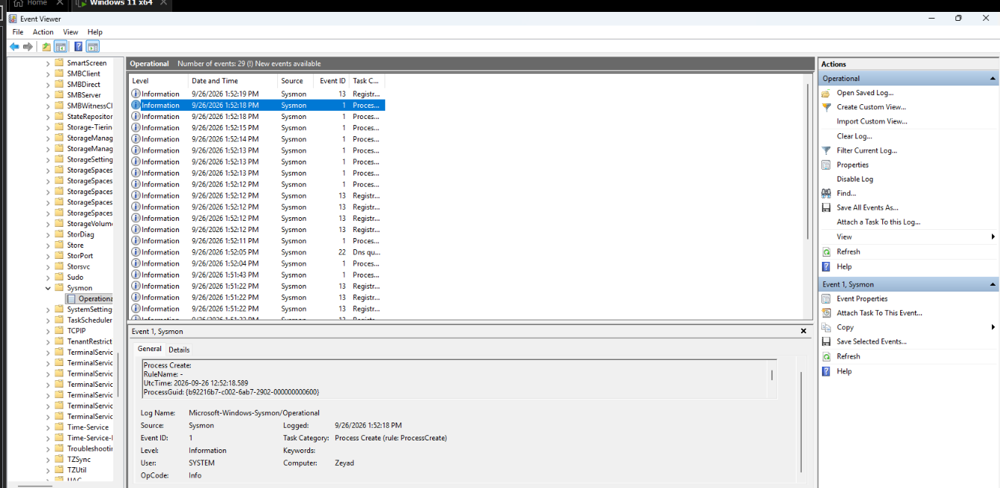
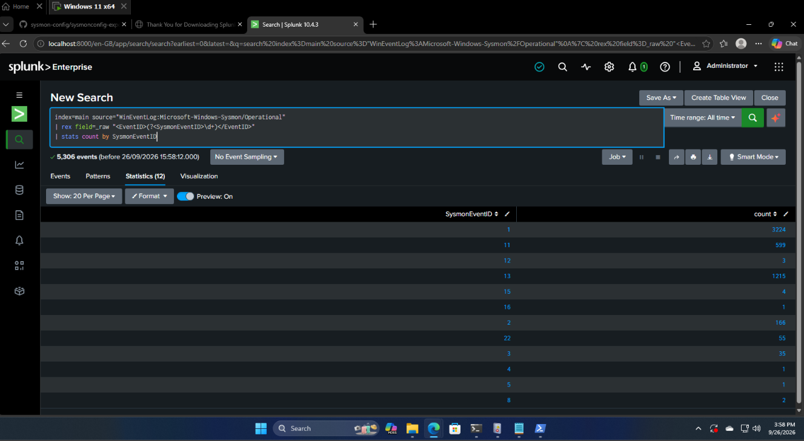
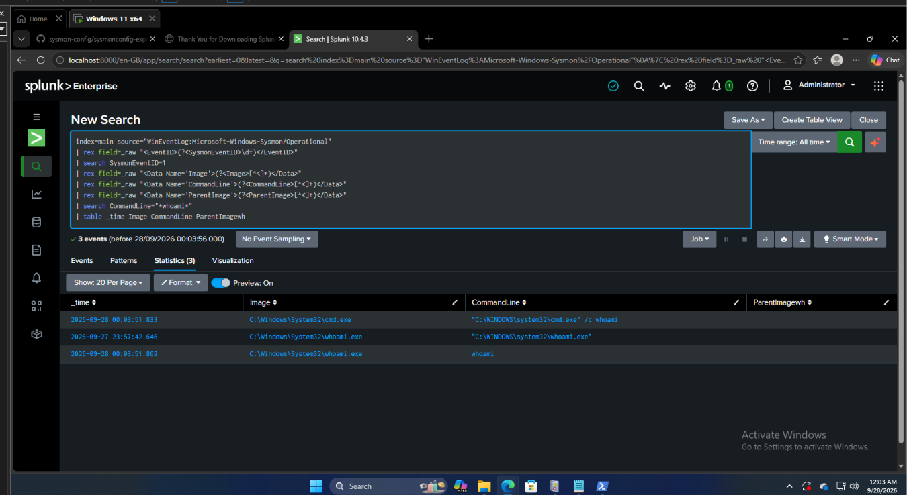
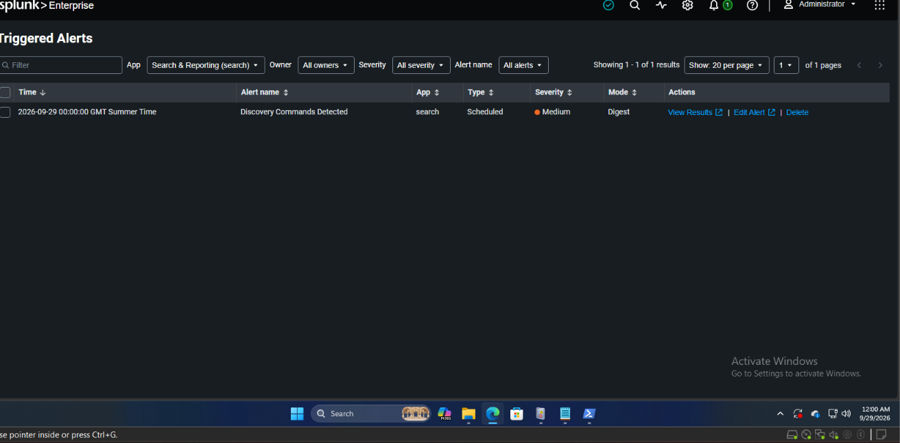
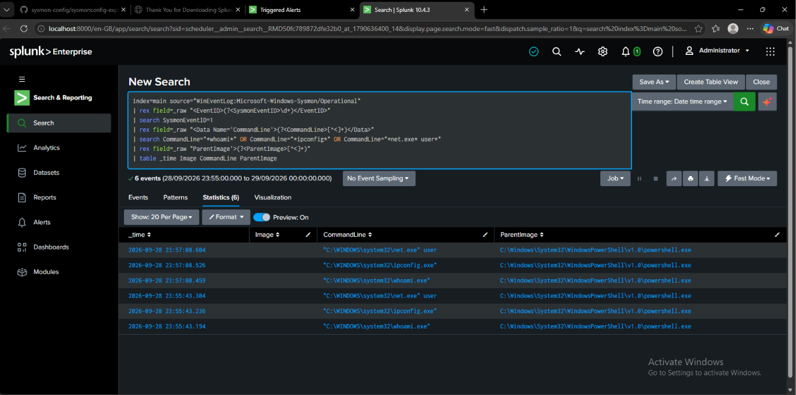
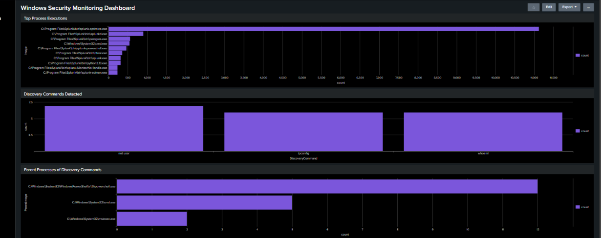

# Windows Sysmon & Splunk Detection Lab

A hands-on Windows security monitoring lab designed to practise SOC-style monitoring, detection, alerting, and investigation using **Sysmon** and **Splunk Enterprise**.

The project demonstrates an end-to-end detection workflow: collecting Windows endpoint telemetry with Sysmon, ingesting the logs into Splunk, analysing process creation events with SPL, detecting common system discovery commands, creating an automated alert, investigating the resulting activity, and visualising the data through a security monitoring dashboard.

---

## 🎯 Project Objectives

The objectives of this project were to:

- Configure Sysmon for detailed Windows endpoint logging.
- Ingest Sysmon events into Splunk Enterprise.
- Analyse Sysmon Process Creation events.
- Extract useful fields from raw event data using SPL.
- Detect common Windows system discovery commands.
- Investigate process and parent-process relationships.
- Create and test a scheduled Splunk alert.
- Build a Windows security monitoring dashboard.

---

## 🏗️ Lab Architecture

```text
Windows 11 VM
      │
      ▼
    Sysmon
      │
      ▼
Windows Event Log
Microsoft-Windows-Sysmon/Operational
      │
      ▼
Splunk Enterprise
      │
      ├── SPL Searches
      │
      ├── Detection Rule
      │
      ├── Scheduled Alert
      │
      └── Security Dashboard
```

---

## 1. Sysmon Process Logging

Sysmon was configured on the Windows 11 virtual machine to generate detailed endpoint telemetry.

The **Microsoft-Windows-Sysmon/Operational** log was verified through Windows Event Viewer.

Of particular interest was:

**Sysmon Event ID 1 — Process Create**

Process creation telemetry is useful during security investigations because it can provide information about executed processes, command lines, users, and parent processes.



---

## 2. Ingesting Sysmon Logs into Splunk

Sysmon events were ingested into **Splunk Enterprise** from the Windows Sysmon Operational event log.

The following SPL search was used to extract Sysmon Event IDs and verify successful ingestion:

```spl
index=main source="WinEventLog:Microsoft-Windows-Sysmon/Operational"
| rex field=_raw "<EventID>(?<SysmonEventID>\d+)</EventID>"
| stats count by SysmonEventID
```

The results confirmed that multiple Sysmon event types were successfully available for analysis inside Splunk, including a large number of **Event ID 1** process creation events.



---

## 3. Process Investigation

After confirming log ingestion, Sysmon Event ID 1 events were analysed to extract useful process information.

The investigation focused on:

- Timestamp
- Process image
- Command line
- Parent process

For example, the following SPL search was used to investigate executions of `whoami`:

```spl
index=main source="WinEventLog:Microsoft-Windows-Sysmon/Operational"
| rex field=_raw "<EventID>(?<SysmonEventID>\d+)</EventID>"
| search SysmonEventID=1
| rex field=_raw "<Data Name='Image'>(?<Image>[^<]+)</Data>"
| rex field=_raw "<Data Name='CommandLine'>(?<CommandLine>[^<]+)</Data>"
| rex field=_raw "<Data Name='ParentImage'>(?<ParentImage>[^<]+)</Data>"
| search CommandLine="*whoami*"
| table _time Image CommandLine ParentImage
```

This allowed the execution of `whoami` to be investigated together with the process responsible for launching it.



---

## 4. Discovery Command Detection

A detection search was developed to identify several common Windows system discovery commands:

- `whoami`
- `ipconfig`
- `net user`

These commands are legitimate Windows utilities and their execution does **not automatically indicate malicious activity**.

However, they are valuable from a detection perspective because system discovery commands may also be executed by an attacker after gaining access to a Windows endpoint.

The detection therefore provides telemetry that an analyst can investigate within the wider context of endpoint activity.

The detection focused on **Sysmon Event ID 1** and inspected the command-line information associated with newly created processes.

---

## 5. Splunk Detection Alert

The discovery command detection was converted into a scheduled Splunk alert named:

### `Discovery Commands Detected`

The alert was configured to trigger when the detection search returned one or more matching events.



Creating the alert demonstrated how an SPL detection search can be operationalised so that relevant activity can be surfaced automatically instead of requiring an analyst to manually execute the search.

---

## 6. Alert Investigation

The detection was tested by executing discovery commands within the Windows lab environment.

Splunk successfully identified matching Sysmon process creation events.

The resulting events could then be investigated using information including:

- Command executed
- Executable image
- Timestamp
- Parent process



This demonstrated the complete detection path from endpoint activity to log generation, ingestion, detection, alerting, and analyst investigation.

---

## 7. Windows Security Monitoring Dashboard

A custom **Windows Security Monitoring Dashboard** was created in Splunk to provide a visual overview of endpoint process activity.

The dashboard contains three main panels:

### Top Process Executions

Displays the most frequently executed processes recorded by Sysmon.

### Discovery Commands Detected

Displays the number of detections associated with:

- `whoami`
- `ipconfig`
- `net user`

### Parent Processes of Discovery Commands

Shows which parent processes were responsible for launching the detected discovery commands.

This can provide additional context when investigating potentially suspicious activity.



---

## 🔎 Detection Workflow

```text
Discovery Command Executed
          │
          ▼
Sysmon Event ID 1
          │
          ▼
Windows Event Log
          │
          ▼
Splunk Ingestion
          │
          ▼
SPL Detection
          │
          ▼
Scheduled Alert
          │
          ▼
SOC Investigation
          │
          ▼
Process & Parent Process Analysis
```

---

## 🛠️ Technologies Used

| Technology | Purpose |
|---|---|
| Windows 11 | Monitored endpoint |
| Sysmon | Endpoint telemetry and process logging |
| Windows Event Viewer | Verification of Sysmon events |
| Splunk Enterprise | SIEM / log analysis platform |
| SPL | Searching, field extraction and detection logic |
| VMware | Virtualised lab environment |

---

## 🧠 Skills Demonstrated

This project demonstrates practical experience with:

- Windows security monitoring
- Sysmon configuration and telemetry
- Windows Event Logs
- Splunk Enterprise
- SPL searches
- SIEM fundamentals
- Log ingestion and analysis
- Process creation monitoring
- Command-line analysis
- Parent/child process investigation
- Detection engineering fundamentals
- Alert creation and testing
- Security dashboard development
- SOC investigation workflow

---

## 📚 Key Takeaways

This project provided practical experience with the full security detection lifecycle rather than focusing only on individual SIEM searches.

I learned how endpoint activity can move through a monitoring pipeline:

**Endpoint Activity → Telemetry → Log Ingestion → Detection → Alert → Investigation**

The lab also improved my understanding of how SOC analysts use process telemetry, command-line information, and parent-process relationships to investigate activity on Windows endpoints.

Most importantly, the project demonstrated how raw endpoint logs can be transformed into useful security detections and visual monitoring data.

---

## 🚀 Future Improvements

Possible future improvements to the lab include:

- Adding additional Sysmon-based detection rules.
- Detecting suspicious PowerShell activity.
- Mapping detections to MITRE ATT&CK techniques.
- Creating additional alerts for suspicious process behaviour.
- Improving field extraction and SPL queries.
- Expanding the dashboard with additional endpoint telemetry.
- Testing additional simulated attack behaviours in the lab.

---

## ⚠️ Disclaimer

This project was created in a controlled virtual lab environment for educational and cybersecurity training purposes.
